<div align="center">

# Qyvaria

### A Deterministic AI Kernel · A Solo AI Engineering Studio · A Browser Built to Run AI Natively

[](./LICENSE)
[](./qyvaria.py)
[](#7-qyvaria-os--the-ai-native-browser)
[](#12-project-status)
[](https://github.com/Havlasek1John)

*Designed, engineered, and maintained solo by [Jan Havlasek](https://github.com/Havlasek1John) — Qyvaria is a donation-supported, independent AI studio.*

</div>

---

## Table of Contents

1. [Introduction & Philosophy](#1-introduction--philosophy)
2. [System Overview](#2-system-overview)
3. [The Kernel — `qyvaria.py`](#3-the-kernel--qyvariapy)
4. [Command Lifecycle & Dispatch Pipeline](#4-command-lifecycle--dispatch-pipeline)
5. [RBAC & Security Model](#5-rbac--security-model)
6. [Kernel Generations: Aetheris → Aeon → Cetana → Varia](#6-kernel-generations-aetheris--aeon--cetana--varia)
7. [Qyvaria AI Software Layer](#7-qyvaria-ai-software-layer)
8. [Qyvaria OS — the AI-Native Browser](#8-qyvaria-os--the-ai-native-browser)
9. [Full-Stack Architecture](#9-full-stack-architecture)
10. [Installation & Usage](#10-installation--usage)
11. [Repository Layout](#11-repository-layout)
12. [Project Status](#12-project-status)
13. [Comparison: Qyvaria OS vs. Conventional AI-in-Browser Products](#13-comparison-qyvaria-os-vs-conventional-ai-in-browser-products)
14. [Roadmap](#14-roadmap)
15. [Frequently Asked Questions](#15-frequently-asked-questions)
16. [Credits](#16-credits)
17. [Contributing & Support](#17-contributing--support)
18. [License](#18-license)

---

## 1. Introduction & Philosophy

Qyvaria is an independent software project built around a simple, uncompromising idea: **an AI system should be traceable from the moment a command is issued to the moment it executes, with no unaccountable layer in between.**

Most modern "AI products" are assembled from disparate, often opaque parts — a hosted model behind an API, a UI framework glued on top, a browser extension layered over a browser that was never designed to host AI natively, and permission systems bolted on as an afterthought. Qyvaria was built to do the opposite: start from a single, auditable core, and build every other capability as a direct, traceable extension of that core.

That philosophy produces three things, developed together, in this repository:

- **A kernel** (`qyvaria.py`) — the deterministic, permission-checked core that every command in the system passes through.
- **AI Software** — the workflows, agents, and tooling that give the kernel something to do.
- **Qyvaria OS** — a Chromium-based browser purpose-built to host that AI software as a first-class citizen of the browsing environment, not a tab running inside someone else's product.

This is not a company with a roadmap dictated by investors, nor a product built to maximize engagement metrics. Qyvaria is developed by one engineer, funded by voluntary donations, and released publicly under an open license so the design decisions — good and imperfect alike — can be inspected rather than taken on faith.

> **Design mantra:** *If a command executes, you should be able to explain exactly why it was allowed to.*

---

## 2. System Overview

Qyvaria is best understood as three concentric layers, each depending on the one below it, and each adding a different kind of capability:

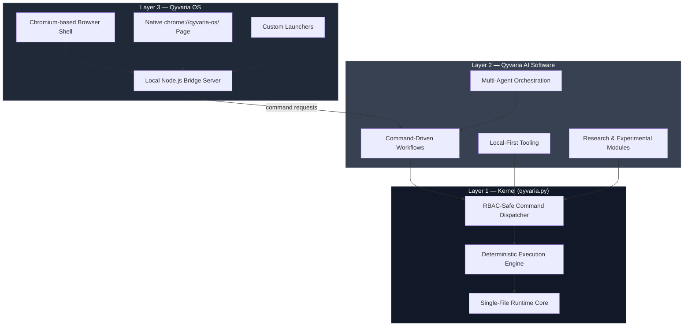

At a glance:

| Layer | Component | Primary Responsibility |
|---|---|---|
| 1 | `qyvaria.py` (Kernel) | Deterministic execution + RBAC-checked command dispatch |
| 2 | Qyvaria AI Software | Turns raw dispatch into usable AI workflows and agents |
| 3 | Qyvaria OS | Hosts the AI software natively inside a Chromium-based browser shell |

Nothing in Layer 2 or Layer 3 is permitted to bypass Layer 1. Every action — whether triggered from a terminal, a script, or a click inside Qyvaria OS — ultimately resolves to a command dispatched through the kernel.

---

## 3. The Kernel — `qyvaria.py`

At the heart of the entire project is a single Python file: **`qyvaria.py`**. This is a deliberate architectural constraint, not a limitation of scope.

### 3.1 Why single-file?

A multi-module codebase hides its true behavior across imports, indirection, and inheritance chains. A single-file kernel forces every core behavior to live in one place, in one linear read. If you can open `qyvaria.py` top to bottom, you have read the entire trust boundary of the system.

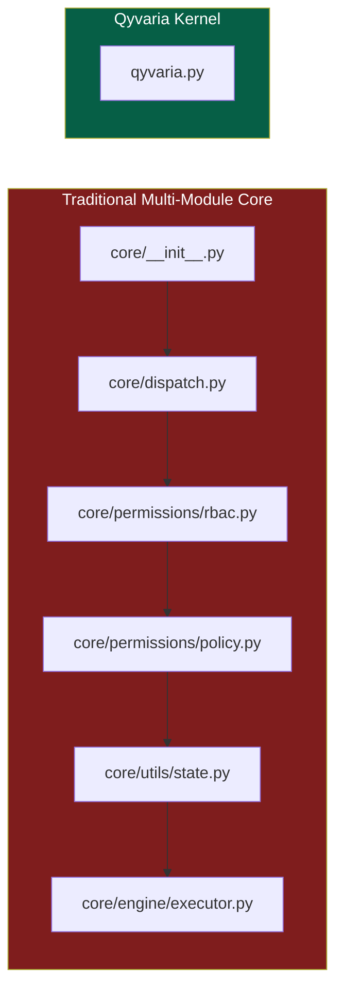

The tradeoff is intentional: single-file design trades some conventional code organization for **total auditability**.

### 3.2 Core kernel properties

| Property | Description |
|---|---|
| **Determinism** | Given identical inputs and an identical seed/state, the kernel always produces identical output. No hidden entropy sources, no silent global-state mutation. |
| **RBAC-safe dispatch** | Every command is resolved against a role-permission table *before* it is allowed to execute — not after, not optionally. |
| **Statelessness between calls** | The kernel does not carry hidden memory between invocations unless state is explicitly passed in. |
| **Portability** | Because it is one file, `qyvaria.py` can be copied, versioned, diffed, and executed independently of the rest of the repository. |
| **Explicit failure** | Rejected commands fail loudly with an identifiable reason code, rather than failing silently or executing a "safe default" behavior. |

### 3.3 Kernel internal structure

Conceptually, the kernel is organized into four cooperating subsystems, all resident in the one file:

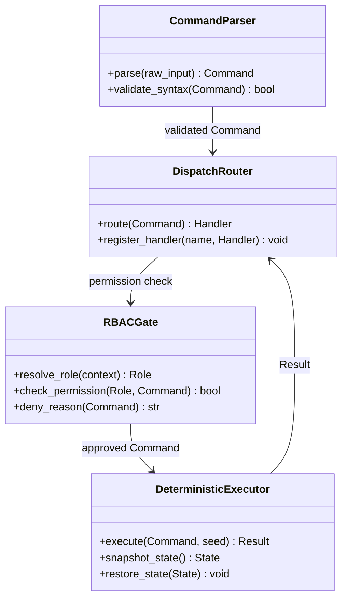

- **CommandParser** — turns raw input (CLI args, API calls, or in-browser events from Qyvaria OS) into a structured `Command` object.
- **DispatchRouter** — decides which internal handler a command should be routed to.
- **RBACGate** — the security checkpoint every command must clear before execution.
- **DeterministicExecutor** — actually runs the approved command, with reproducibility guarantees.

### 3.4 Example invocation

```bash
python qyvaria.py --subject "example task" --engine generic -n 4
```

Deterministic (seeded) invocation, guaranteeing reproducible output across runs and machines:

```bash
python qyvaria.py --subject "example task" --engine generic -n 4 --seed 42
```

---

## 4. Command Lifecycle & Dispatch Pipeline

Every command entering the Qyvaria system — regardless of whether it originates from a terminal, a Qyvaria AI Software workflow, or a click inside Qyvaria OS — follows the same lifecycle.

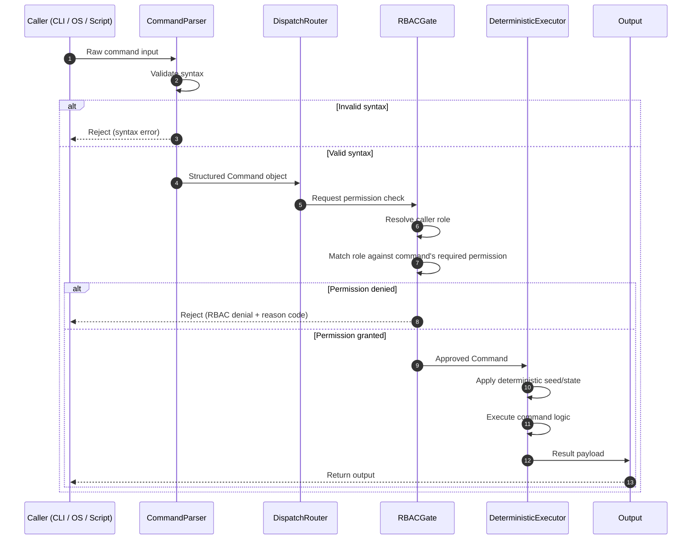

This lifecycle is identical whether the caller is a developer running `qyvaria.py` directly from a terminal, or a browser event inside Qyvaria OS being relayed through the local Node.js bridge server. **The kernel does not have a "trusted" fast path** — every caller goes through the same parser, the same RBAC gate, and the same executor.

### 4.1 Failure states are explicit

A rejected command in Qyvaria never fails silently or falls back to a default action. It returns a specific, identifiable reason:

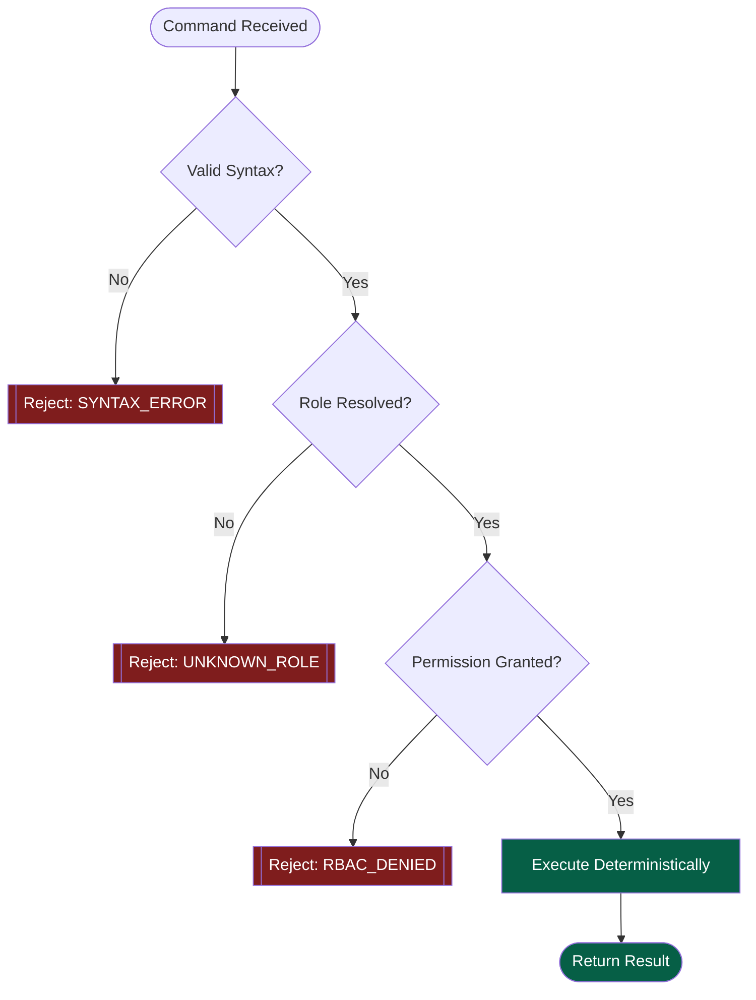

---

## 5. RBAC & Security Model

Role-Based Access Control (RBAC) is not an add-on in Qyvaria — it is the gate every command must clear before the executor ever touches it.

### 5.1 Role hierarchy

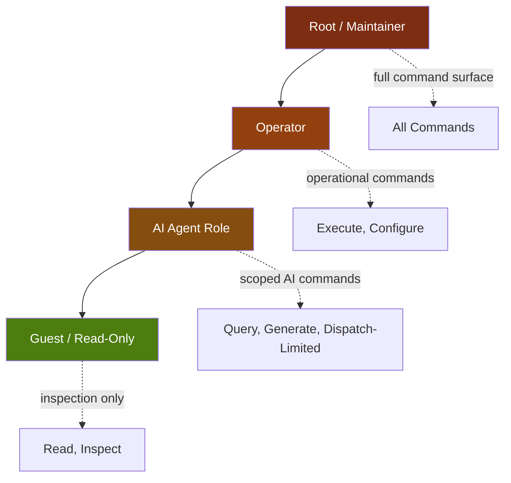

| Role | Typical Caller | Command Surface |
|---|---|---|
| **Root / Maintainer** | The project maintainer, local trusted operator | Full access to all kernel commands, including configuration and permission changes |
| **Operator** | A trusted local process or script | Execute and configure operational commands, no permission-table changes |
| **AI Agent** | A Qyvaria AI Software agent or workflow | Scoped access — generate, query, and dispatch within defined boundaries |
| **Guest / Read-Only** | Qyvaria OS UI in an unauthenticated context | Inspection and read-only commands only |

### 5.2 Why RBAC lives in the kernel, not the application layer

If permission checking lived in the AI software layer or the browser shell, a bug or a malicious workflow at either of those layers could bypass it entirely. By placing RBAC inside the kernel itself — the one component every layer must route through — there is no code path in the system that reaches execution without a permission check.

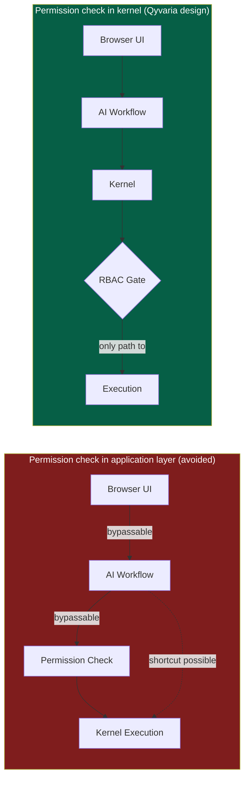

---

## 6. Kernel Generations: Aetheris → Aeon → Cetana → Varia

The kernel did not arrive at its current form in one attempt. It has passed through four internal generations, each addressing limitations discovered in the previous one.

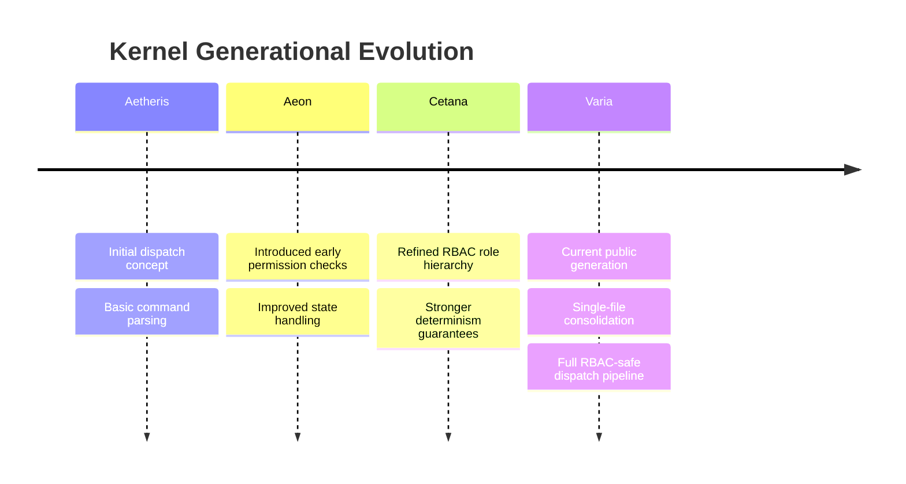

| Generation | Focus | Key Advancement |
|---|---|---|
| **Aetheris** | Foundational dispatch | Established the idea of a command object and a routed handler model |
| **Aeon** | Access control groundwork | Introduced the first permission-checking logic ahead of execution |
| **Cetana** | Structural refinement | Formalized the role hierarchy and tightened determinism guarantees |
| **Varia** | Current generation | Consolidated everything into the single-file `qyvaria.py`, with the full RBAC-safe dispatch pipeline described in [Section 4](#4-command-lifecycle--dispatch-pipeline) |

Each generational name is retained internally as a versioning concept — a way of tracking *architectural* generations of the kernel, distinct from ordinary semantic version numbers.

---

## 7. Qyvaria AI Software Layer

Everything a user or developer actually *does* with Qyvaria — beyond raw kernel calls — lives in the AI Software layer. This is where commands become workflows, and workflows become usable capabilities.

### 7.1 Multi-agent orchestration

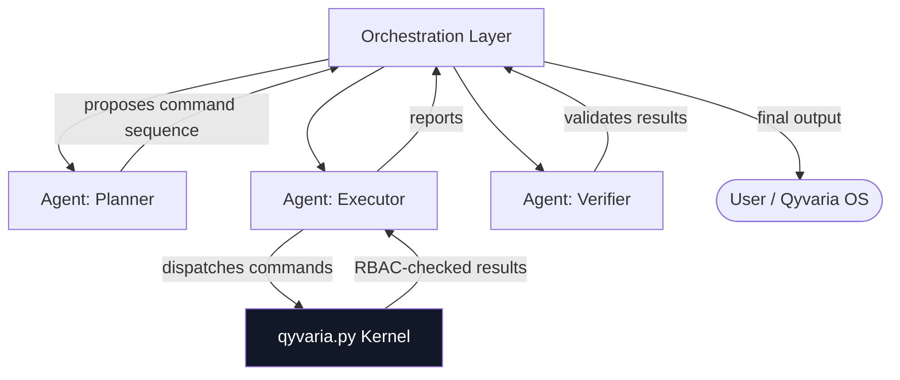

Agents in this model do not talk to each other directly — they communicate through the orchestration layer, and any command that needs to actually *do* something is routed down to the kernel, where it is subject to the same RBAC gate described in Section 5.

### 7.2 Workflow execution model

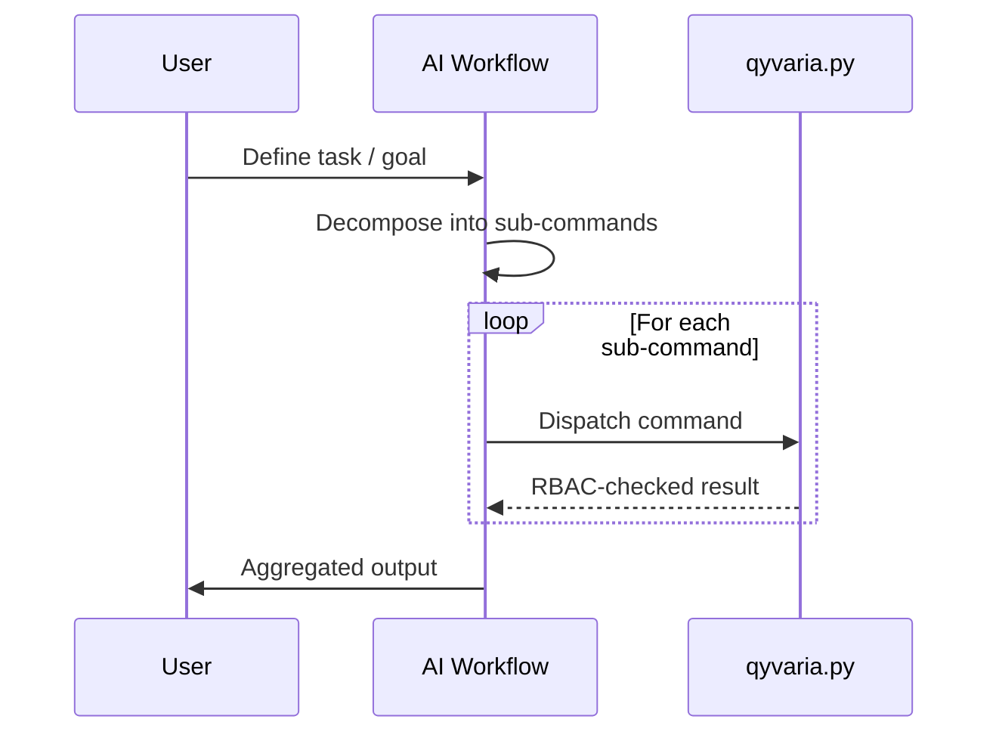

### 7.3 Categories of AI Software modules

| Category | Description | Maturity |
|---|---|---|
| **Command-driven workflows** | Direct, scripted sequences of kernel dispatches for a defined task | Stable |
| **Multi-agent orchestration** | Coordinated agent roles cooperating on a shared, permission-checked command surface | Active development |
| **Local-first tooling** | Utilities designed to run entirely on the user's own machine, with no required hosted backend | Stable |
| **Research modules** | Experimental capabilities, explicitly marked as unstable or exploratory | Experimental |

---

## 8. Qyvaria OS — the AI-Native Browser

**Qyvaria OS** is where the kernel and the AI software layer stop being developer tools and become a product a person can actually open and use.

Most "AI in the browser" experiences today are extensions layered on top of Chrome, Firefox, or Edge — sidebars, popups, and injected scripts running inside a browser that was never designed with AI as a first-class citizen. **Qyvaria OS inverts that relationship.** It is a Chromium-based browser where the AI layer is part of the shell itself, not a guest inside it.

### 8.1 High-level architecture

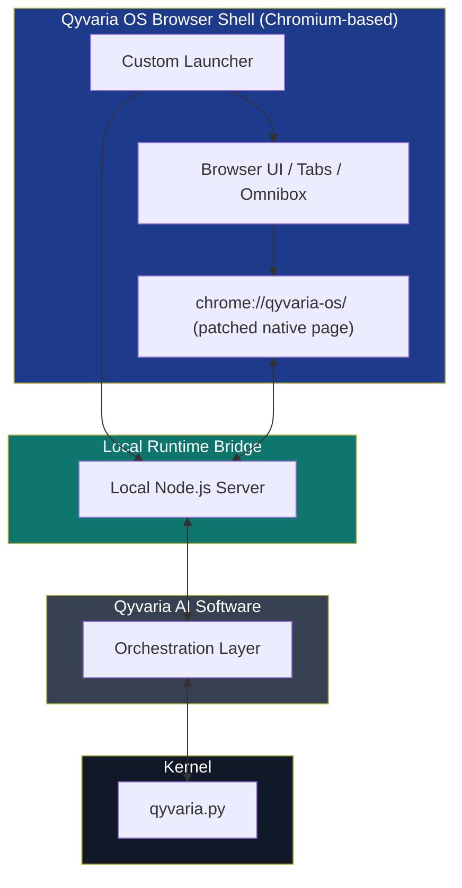

### 8.2 The native `chrome://qyvaria-os/` page

Chromium exposes a family of privileged, non-web-reachable internal pages — `chrome://settings`, `chrome://extensions`, `chrome://flags`, and so on. These pages are compiled directly into the browser binary and cannot be reached or spoofed by ordinary web content.

Qyvaria OS extends this same mechanism through source-level patching of the Chromium build, so that `chrome://qyvaria-os/` behaves as a **native, first-class internal page** rather than a bundled extension page or a locally-hosted web app opened in a tab.

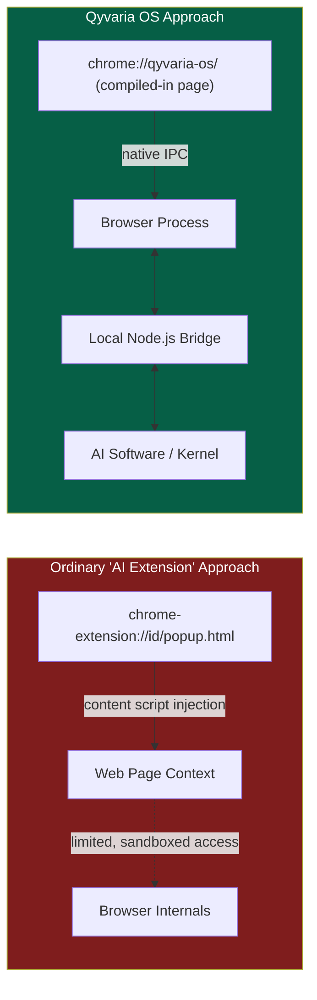

### 8.3 The local Node.js bridge server

Because a Chromium browser process is sandboxed from the host system by design, Qyvaria OS uses a **local Node.js server**, running alongside the browser, as the bridge between:

- the native `chrome://qyvaria-os/` UI,
- the Qyvaria AI Software orchestration layer, and
- ultimately, the `qyvaria.py` kernel.

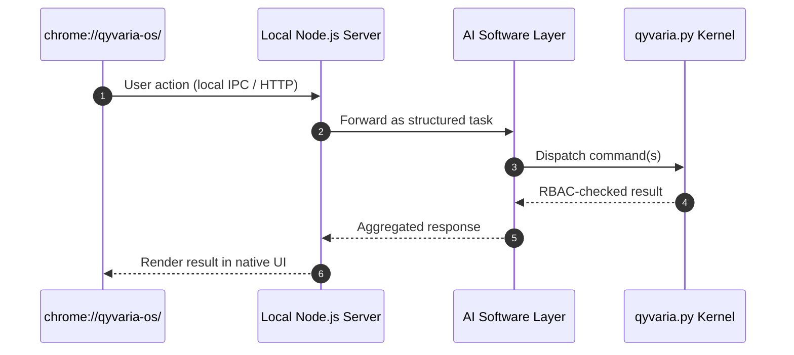

This keeps a clean separation of concerns: the browser shell is responsible for presentation, the Node.js server is responsible for local process bridging, the AI software layer is responsible for orchestration, and the kernel remains the single point of execution and permission enforcement.

### 8.4 Custom launchers

Qyvaria OS ships with **custom launchers** for both supported platforms. A launcher's job is to start the browser shell and the local Node.js bridge server together, as a single coordinated startup sequence, rather than requiring a user to manually start a backend process before opening a browser window.

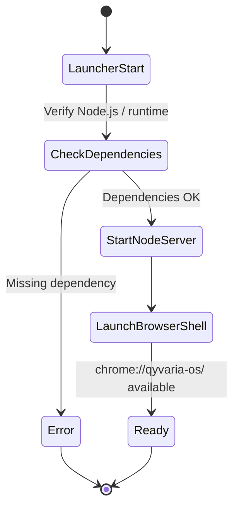

### 8.5 Phased development

Qyvaria OS is being developed in explicit phases rather than as a single monolithic release. The current toolkit generation is **Phase 4**.

```mermaid
gantt
    title Qyvaria OS - Toolkit Development Phases
    dateFormat  X
    axisFormat %s

    section Phase 1
    Core browser shell exploration     :done, p1, 0, 1
    section Phase 2
    Local server bridge prototype      :done, p2, 1, 2
    section Phase 3
    Launcher system Win/Linux          :done, p3, 2, 3
    section Phase 4
    Native URL patching groundwork     :active, p4, 3, 5
    section Phase 5
    Full native build pipeline         :p5, 5, 7
```

> **Note on running native builds:** Full native Qyvaria OS builds — particularly the source-patched Chromium variant that enables `chrome://qyvaria-os/` — require a genuine **Linux desktop environment** with substantial build resources (disk space, memory, and CPU time comparable to building Chromium itself). This is expected: Qyvaria OS is not a thin wrapper, it is a real browser build with a custom layer patched into the source tree.

---

## 9. Full-Stack Architecture

Bringing every layer together, the complete Qyvaria stack looks like this end-to-end:

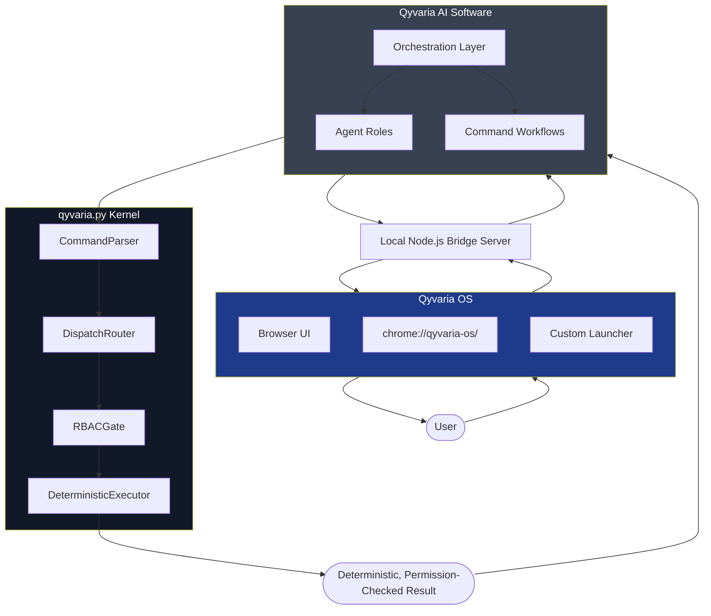

The important invariant, visible in every diagram in this document: **there is exactly one path to execution, and it always passes through the RBAC gate inside the kernel.** Whether the entry point is a terminal command, a scripted AI workflow, or a click inside the Qyvaria OS browser shell, the same guarantees apply every time.

---

## 10. Installation & Usage

### 10.1 Requirements

| Component | Requirement |
|---|---|
| Kernel (`qyvaria.py`) | Python 3.x |
| Qyvaria AI Software | Python 3.x, kernel dependencies from `requirements.txt` |
| Qyvaria OS (packaged) | Node.js 20+ (Windows especially) |
| Qyvaria OS (native/patched build) | Linux desktop environment, Chromium build toolchain, substantial disk/RAM/CPU |

### 10.2 Running the kernel directly

```bash
git clone https://github.com/Havlasek1John/Qyvaria.git
cd Qyvaria
pip install -r requirements.txt
python qyvaria.py --subject "your task" --engine generic -n 4
```

For fully reproducible output:

```bash
python qyvaria.py --subject "your task" --engine generic -n 4 --seed 42
```

### 10.3 Launching Qyvaria OS (packaged builds)

Packaged builds are distributed via [GitHub Releases](https://github.com/Havlasek1John/Qyvaria/releases) rather than committed directly to the repository, to keep the source tree lightweight.

**Linux**

```bash
unzip "Qyvaria_OS_Linux.zip"
cd "Qyvaria OS (Linux)"
chmod +x SETUP_QYVARIA_OS_LINUX.sh
./SETUP_QYVARIA_OS_LINUX.sh
```

**Windows**

```bat
unzip "Qyvaria_OS_Windows.zip"
cd "Qyvaria OS (Windows)"
SETUP_QYVARIA_OS_WINDOWS.cmd
```

### 10.4 Verifying a release

Release archives are published alongside checksums. Verify integrity before running any setup script:

```bash
sha256sum -c CHECKSUMS.sha256
```

---

## 11. Repository Layout

```
Qyvaria/
├─ README.md
├─ LICENSE
├─ NOTICE
├─ CREDITS.md
├─ ACKNOWLEDGEMENTS.md
├─ THIRD_PARTY_NOTICES.md
├─ SECURITY.md
├─ CONTRIBUTING.md
├─ CODE_OF_CONDUCT.md
├─ SUPPORT.md
├─ CHANGELOG.md
├─ CITATION.cff
├─ pyproject.toml
├─ requirements.txt
├─ CHECKSUMS.sha256
├─ qyvaria.py                     # The kernel — single-file core
└─ apps/
   └─ qyvaria-os/                 # Qyvaria OS toolkit
      ├─ launchers/                # Platform-specific custom launchers
      ├─ bridge-server/            # Local Node.js bridge server
      └─ patches/                  # Chromium source patches for native chrome://qyvaria-os/
```

Large binaries (Qyvaria OS platform packages, build archives) are intentionally kept out of the committed source tree and published as versioned Release assets.

---

## 12. Project Status

Qyvaria is developed and maintained by a single engineer, in public, on an ongoing basis. Nothing in this repository should be read as a "finished, frozen" product — it is a living system.

| Component | Status | Notes |
|---|---|---|
| Kernel (`qyvaria.py`) | Stable, actively maintained | Currently on the **Varia** generation |
| RBAC dispatch pipeline | Stable | Core security invariant of the whole system |
| Qyvaria AI Software — workflows | Stable | Command-driven workflows in daily use |
| Qyvaria AI Software — multi-agent orchestration | Active development | API surface may change between releases |
| Qyvaria AI Software — research modules | Experimental | Explicitly unstable, subject to removal |
| Qyvaria OS — launchers | Stable | Windows and Linux launchers available |
| Qyvaria OS — local Node.js bridge | Stable | Core bridging mechanism |
| Qyvaria OS — native `chrome://qyvaria-os/` patching | Phase 4, active development | Requires Linux desktop + Chromium build environment |

---

## 13. Comparison: Qyvaria OS vs. Conventional AI-in-Browser Products

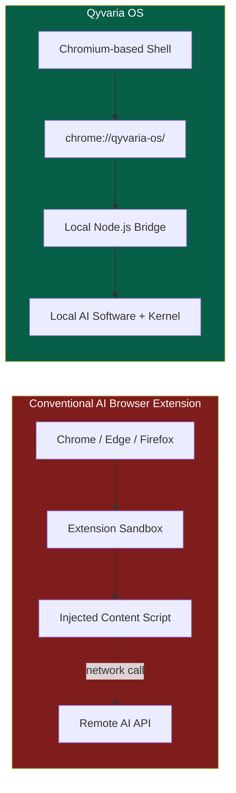

| Dimension | Conventional AI Extension | Qyvaria OS |
|---|---|---|
| **Integration depth** | Injected into an existing browser via extension APIs | Compiled into the browser shell via source patching |
| **AI execution location** | Typically remote, via hosted API | Local-first, via kernel + AI software running alongside the browser |
| **Permission model** | Browser extension permission scopes | Kernel-level RBAC, independent of browser extension permissions |
| **Command auditability** | Often opaque, vendor-controlled | Every command traceable through a single, deterministic kernel |
| **Native UI surface** | Popup / sidebar / injected DOM elements | First-class internal page (`chrome://qyvaria-os/`) |
| **Startup model** | Browser starts normally; extension activates separately | Custom launcher starts browser shell and bridge server together |

---

## 14. Roadmap

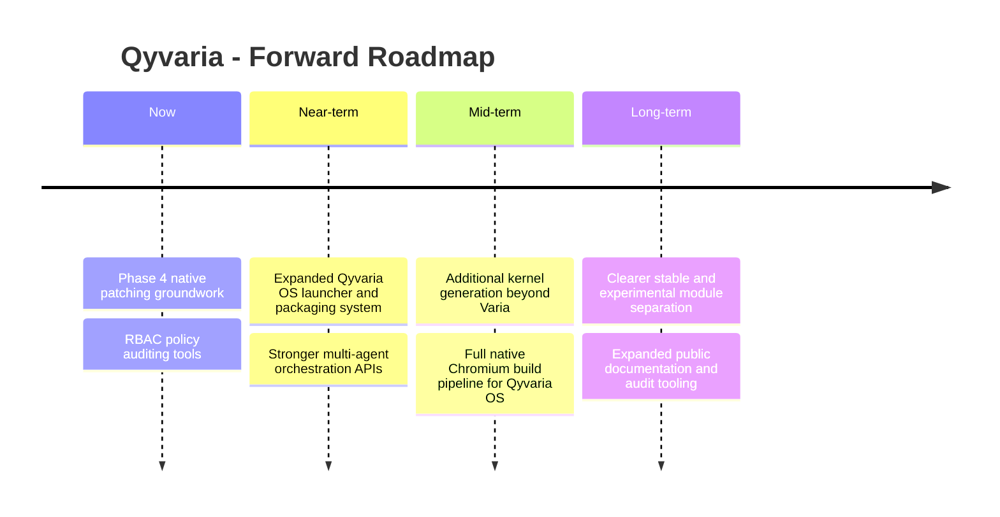

- Deeper native Chromium integration for `chrome://qyvaria-os/`
- A more complete Qyvaria OS launcher and packaging system across platforms
- A kernel generation beyond **Varia**, focused on RBAC policy auditing and reporting
- Expanded, versioned documentation for every layer of the stack
- Clearer public labeling of which AI Software modules are stable vs. experimental

---

## 15. Frequently Asked Questions

**Is Qyvaria a company?**
No. Qyvaria is a solo, donation-supported AI engineering project maintained by one person, developed and released publicly.

**Do I need Qyvaria OS to use the kernel?**
No. `qyvaria.py` runs standalone from the command line. Qyvaria OS is a native runtime environment for the AI software, not a requirement for using the kernel itself.

**Can I run Qyvaria OS on Windows without a full Chromium source build?**
Yes — packaged Windows and Linux builds are available via GitHub Releases. Only the fully native, source-patched `chrome://qyvaria-os/` variant requires a Linux build environment.

**Why RBAC instead of a simpler permission model?**
Because Qyvaria is designed to support multiple callers with different trust levels — a human operator, an AI agent, and a read-only browser context — a role-based model scales cleanly, and keeps the enforcement logic inside the kernel rather than scattered across each caller.

**Is the project open source?**
Yes, under the Apache License 2.0. See [Section 18](#18-license).

---

## 16. Credits

**Creator and maintainer**
Jan Havlasek — designer and engineer of the `qyvaria.py` kernel, Qyvaria AI Software, and Qyvaria OS.

**Special thanks**
Jiri Burda, for testing, feedback, and support throughout development.

**Open source foundations**
Qyvaria depends on, and is grateful to, the broader open-source ecosystem — including Python, Node.js, and Chromium — along with the communities that maintain them. Full attribution is in [`THIRD_PARTY_NOTICES.md`](./THIRD_PARTY_NOTICES.md).

---

## 17. Contributing & Support

Contributions, issue reports, and technical feedback are welcome, provided they respect the project's Apache-2.0 licensing, attribution requirements, and a strict no-secrets policy (no API keys, tokens, or private data in issues or pull requests).

- Community discussion: [Qyvaria Forums](https://qyvaria.boards.net/)
- Public project index: [Qyvaria Software Index](https://qyvaria-ai-studio-index.vercel.app/)
- Bug reports and technical issues: [GitHub Issues](https://github.com/Havlasek1John/Qyvaria/issues)

Before opening a pull request, please read [`CONTRIBUTING.md`](./CONTRIBUTING.md), [`SECURITY.md`](./SECURITY.md), and [`CODE_OF_CONDUCT.md`](./CODE_OF_CONDUCT.md).

---

## 18. License

Qyvaria — the kernel, the AI software, and Qyvaria OS — is released under the **Apache License 2.0**.

```
Copyright Jan Havlasek — Qyvaria
Licensed under the Apache License, Version 2.0
https://github.com/Havlasek1John/Qyvaria
```

See [`LICENSE`](./LICENSE) for the full text.

---

<div align="center">

**Qyvaria: one kernel, one dispatch path, one place to look when you need to know why something ran.**

</div>
